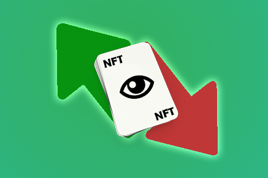
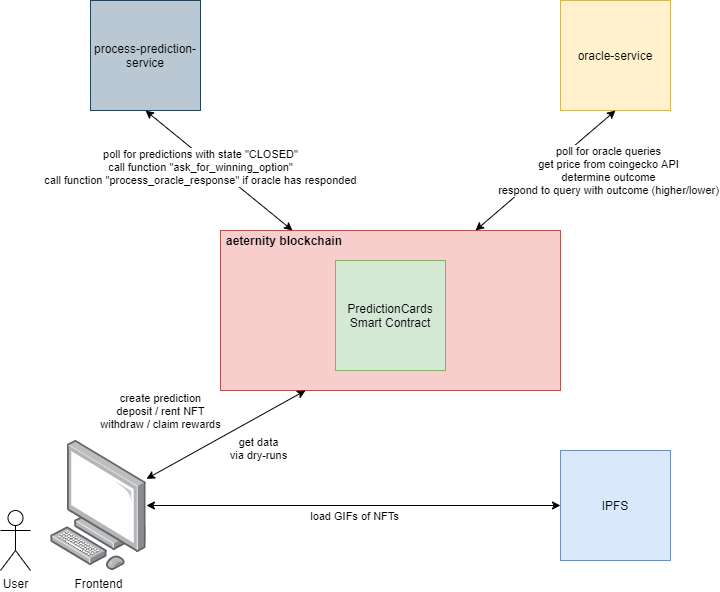

    

<h1 align="center">
  Prediction Cards
</h1>

# About
Prediction Cards is a hybrid of NFT art and prediction markets.

Each outcome of a certain prediction is a unique Non Fungible Token (NFT). Instead of betting on an outcome, someone owns it (or to be more accurate, someone rents it). Concepts such as shares, bids, asks do not exist- even 'odds' are abstracted away, replaced by a 'rental price' for a specific interval (default: 1 day). At the end of the event, the longest renter of each outcome becomes its owner (regardless of whether or not the outcome was correct). It thus becomes a collectable and can be traded or transferred to other addresses. Currently this is a quite simple solution where we only allow predictions for future asset prices that can have two outcomes and thus two different NFTs (lower_or_equal / higher). For each outcome a specific GIF image can be selected by the creator of the prediction.

_The original project where the idea comes from is https://realitycards.io/_

# Architecture

  

# How we built it

## Smart Contract
The Smart Contract was written in virtual pair programming by Michel (@mitch-lbw) and Marco (@marc0olo). We used our [aepp-sdk-java](https://github.com/kryptokrauts/aepp-sdk-java) in combination with our [contraect-maven-plugin](https://github.com/kryptokrauts/contraect-maven-plugin) that allows developers to generate Java classes for Smart Contracts written in Sophia. With these generated classes we were able to easily interact with the Smart Contract (deployment as well as _type-safe_ calls of functions). The cool thing about this is that we were able to write our contract tests (which aren't complete yet) in pure Java.

## Oracle-service & process-prediction-service
Michel and Marco also wrote the oracle-service and the process-prediction-service in Java. The oracle-service registers an oracle and makes sure that it never expires. It also polls in a certain interval whether a query has been requested via an _OracleQueryTx_. If an oracle query is present the oracle processes it by checking the price and responds with the respective result (lower / higher). The process-prediction-service periodically checks if a certain prediction has ended and performs the _OracleQueryTx_ to ask the oracle for the correct outcome. If the oracle responds in time this service will also perform a contract call to process the prediction outcome so that the Smart Contract can determine the winner NFT and the owners of the outcome NFT based on their renting time. The renter that HODL´ed the outcome NFT the longest time-period (accumulated) becomes the owner of it.

## AENS name with contract pointer
We claimed the name [predictioncards.chain](https://testnet.aenalytics.org/names/predictioncards.chain) and are using it to point to the address of our deployed contract.

## Frontend with connection to Superhero Wallet
The frontend was written in React by Jan-Patrick (@the-icarus) and makes use of the [aepp-sdk-js](https://github.com/aeternity/aepp-sdk-js). We allow the users to connect to the application using the Superhero Wallet extension so that they can easily create new predictions or rent a specific outcome NFT. We are using the contract pointer of predictioncards.chain to resolve the contract address for calling the contracts functions. If the outcome of a prediction is processed each of the winning NFT renters can claim their rewards which are distributed based on the time-period the renter HODL`ed it and the total amount collected for the prediction (higher and lower rents).

## NFT images
The GIF images that can be selected for the ourcome NFTs were created by Andreas (@mueller-andreas-ltb) and have been stored on IPFS using [Pinata](https://pinata.cloud/).

# Challenges we ran into
- Bugs in our contraect-maven-plugin that have been resolved during development
   - https://github.com/kryptokrauts/contraect-maven-plugin/pull/50
- Sophia development / functional programming
   - The REPL (https://repl.aeternity.io/) was extremly helpful to test certain code snippets on demand
- We wanted the oracle to respond with string value which is an `Int` and convert it into `Int`
   - Unfortunately in Lima this isn't possible (=> functionality shipped with the upcoming Iris hardfork)
   - As "workaround" the oracle is now expected to respond with the values "higher" or "lower" which are used to determine the winning outcome NFT
- Read-only dry-run calls using Superhero Wallet on testnet weren't be possible
   - We generally needed a default address that is being used to call the read-only entrypoints of a contract
   - We needed to adapt functions require the user address as param instead of using `Call.caller` within the function
- We "slightly" underestimated the workload to get the project in a working state (we had some sleepless nights xD)
- We discovered some classloading / dependency issues trying to run a Quarkus based application which dynamically interacts with the generated contract class
- We had issues using Superhero Wallet in a local test environment
    - It somehow tried to broadcast a transaction twice resulting in an error due to a wrong nonce
- We made some bad design decisions concerning providing contract data to the frontend
    - The frontend needs to make a decent amount of requests to display all the data we need

# Accomplishments that we're proud of
- We worked asynchronous on our tasks in a decentralized manner with almost no communication overhead
- We developed a fully working product that can be used on testnet
- We used our own tools to develop and test the Smart Contract
- We set up a decentralized architecture that covers the whole prediction process automatically
    - The proccess-prediction-service can handle new contract deployments by checking our AENS pointer of `predictioncards.chain` and using the new pointer address

# What we learned
- We improved our functional programming skills
- Browsers cannot handle large datasets with [glassmorphisnm](https://glassmorphism.com/)

# What's next for Prediction Cards
- "My cards" section to display the cards owned
- Leaderboard (global, prediction specific, ...) based on HODL time
   - specifically important for an NFT to see who is the winner based on the current timestamp 
- More statistics
- Possibility to transfer NFTs
- Simple offer/bid marketplace
- More decentralized oracles, e. g. a human crowd-oracle solution that allows to resolve generic outcomes
- Generic outcomes where the oracle resolves the winning outcome NFT id
    - Would allow to bet on any kind of outcome we can imagine
- Involvement of artists to provide unique and creative arts for the NFTs

# Support us

If you like this project we would appreciate your support. You can find multiple ways to support us here:

- https://kryptokrauts.com/support